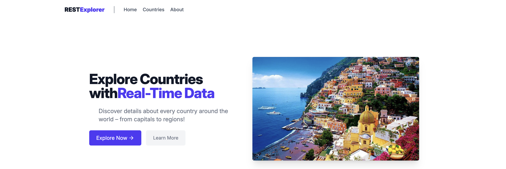

<div align="center">
  
  
  
  
</div>

# World Explorer

A platform to explore all the countries in world and get basic info. This is using https://restcountries.com to fetch up-to-date data.


[Checkout the demo](https://world-explorer-one.vercel.app/)


## <a name="features">🔋 Features</a>

👉 **Updated Records**: Displays the latest records about all countries in the world.

👉 **Search and Filter**: Allows users to search and filter by regions like Asia, Eurpoe, etc.


## Tech Stack

**Framework:** React Router v7 (Typescript)

**Styling:** TailwindCSS

**Bundler:** Vite

## <a name="quick-start">🤸 Quick Start</a>

Follow these steps to set up the project locally on your machine.


**Installation**

Install the project dependencies using npm:

```bash
npm install
```


**Running the Project**

```bash
npm run dev
```
